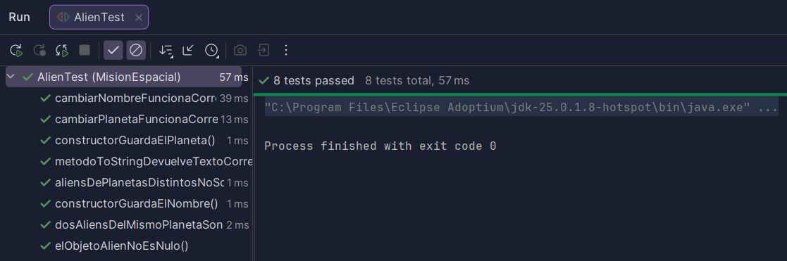
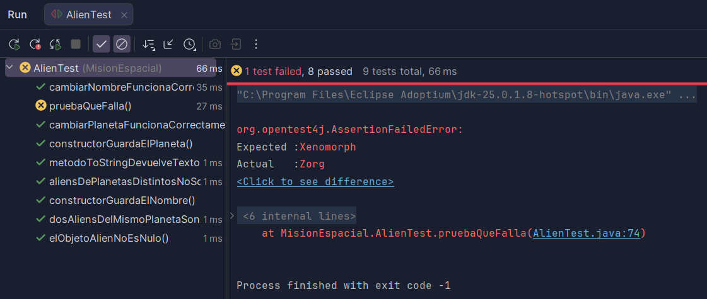
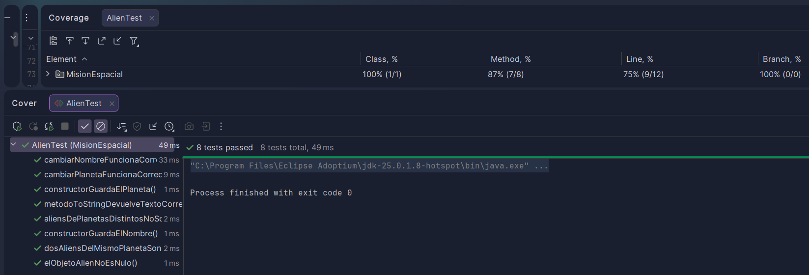

# Pruebas Unitarias en Java con JUnit


Proyecto de **pruebas unitarias en Java** utilizando **JUnit 5**.

Este proyecto forma parte de una práctica de la asignatura **Entornos de Desarrollo**, donde se comprueba el correcto funcionamiento de una clase llamada `Alien`.

En la historia de la práctica, el software pertenece a un sistema de la **NASA** que registra especies extraterrestres detectadas por sondas espaciales.

Antes de utilizar el código en una misión real, es necesario **comprobar que funciona correctamente mediante tests**.

---

# Objetivo de la práctica

El objetivo es aprender a:

- Crear un proyecto Java con **Maven**
- Añadir **JUnit 5** al proyecto
- Crear **pruebas unitarias**
- Ejecutar los tests en IntelliJ
- Interpretar los resultados
- Analizar la **cobertura de código**

---

# Clase Alien

La clase `Alien` representa una forma de vida extraterrestre detectada por una sonda espacial.

Cada alien tiene dos atributos principales:

- **name** → nombre de la especie
- **planetId** → identificador del planeta donde fue detectada

### Funcionalidades de la clase

La clase incluye:

- Constructor
- Getters y Setters
- Método `equals()`
- Método `toString()`

Dos objetos `Alien` se consideran **iguales si tienen el mismo `planetId`**.

---

# Tests implementados

Se han creado varios tests para comprobar el funcionamiento de la clase.

### Tests del constructor

- `elConstructorGuardaElNombre()`  
  Comprueba que el constructor guarda correctamente el nombre del alien.

- `elConstructorGuardaElPlaneta()`  
  Comprueba que el constructor guarda correctamente el identificador del planeta.

---

### Test del método toString

- `elMetodoToStringDevuelveTextoCorrecto()`  
  Comprueba que el método `toString()` devuelve el texto esperado.

---

### Tests del método equals

- `dosAliensDelMismoPlanetaSonIguales()`  
  Comprueba que dos aliens con el mismo `planetId` se consideran iguales.

- `aliensDePlanetasDistintosNoSonIguales()`  
  Comprueba que dos aliens de planetas distintos no son iguales.

---

### Tests de los setters

- `cambiarNombreFuncionaCorrectamente()`  
  Se cambia el nombre del alien con `setName()` y se comprueba que el cambio se guarda correctamente.

- `cambiarPlanetaFuncionaCorrectamente()`  
  Se cambia el `planetId` con `setPlanetId()` y se comprueba que el cambio se guarda correctamente.

---

### Test adicional

- `elObjetoAlienNoEsNulo()`  
  Comprueba que el objeto creado no es nulo.

---

# Estructura del proyecto


```
AlienTest
│
├── src
│ ├── main
│ │ └── java
│ │ └── alien/types
│ │ └── Alien.java
│ │
│ └── test
│ └── java
│ └── MisionEspacial
│ └── AlienTest.java
│
└── pom.xml
```
---
# En un proyecto Maven:

- El **código principal** se guarda en `src/main/java`

- Las **pruebas unitarias** se guardan en `src/test/java`

---

# Ejecución de los tests

Para ejecutar las pruebas en IntelliJ:

1. Click derecho sobre `AlienTest`
2. Seleccionar **Run AlienTest**

Si todos los tests pasan correctamente aparecerán **en verde**.

---

# Ejemplo de tests correctos

### Resultado de los tests correctos



---

# Ejemplo de test que falla

Para entender mejor cómo funciona JUnit, se creó un test con un valor incorrecto:

```java
assertEquals("Xenomorph", alien.getName());
```

Al ejecutar este test se produce un error porque el valor esperado no coincide con el valor real.

- **Expected:** Xenomorph
- **Actual:** Zorg

Esto ayuda a localizar rápidamente el error y entender qué valor está fallando.

### Resultado del test fallido




---

# Cobertura de código

También se ejecutaron los tests utilizando la opción **Run with Coverage** de IntelliJ.

La cobertura de código permite comprobar **qué partes del programa han sido ejecutadas por los tests**.

En IntelliJ los colores indican:

- **Verde** → código ejecutado por los tests
- **Rojo** → código no ejecutado

### Resultado de la cobertura

