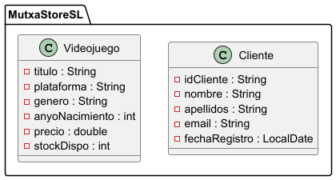

# UP05 – Entornos de Desarrollo
## Comparativa profesional entre JIRA y Trello

---

## Descripción de la práctica

En esta práctica se ha realizado una comparación entre JIRA y Trello simulando un entorno profesional de desarrollo de software.

Se han trabajado tres fases:

1. Trabajo individual
2. Simulación profesional por parejas
3. Reflexión final

---

# FASE 1 – Trabajo Individual

## Objetivo

Experimentar el mismo flujo de trabajo en ambas herramientas utilizando metodología Kanban.

## Herramientas utilizadas

- Jira Software
- Trello
- GitHub
- IntelliJ IDEA

---

## Configuración realizada

### Columnas creadas en ambos tableros

- To Do
- In Progress
- Ready for Testing
- Test
- Done

---

## Tarea creada

**Título:** Preparar práctica de Entornos de Desarrollo (UD5)

Incluye:

- Descripción detallada
- Fecha de entrega
- Asignación personal
- Prioridad alta
- Etiqueta identificativa
- Comentarios de seguimiento

Se simuló el flujo completo moviendo la tarea por todas las columnas:

To Do → In Progress → Ready for Testing → Test → Done

---

# FASE 2 – Simulación Profesional

## Documento de requisitos

Empresa: MutxaStore Manager S.L.

Se solicita modelar:

- Clase `Videojuego`
- Clase `Cliente`

---

## Historia de Usuario – Clase Videojuego

**Como** administrador de la tienda  
**Quiero** modelar la clase Videojuego  
**Para** poder gestionar correctamente el catálogo de productos

### Subtareas

- Definir atributos
- Crear constructor
- Implementar getters y setters
- Revisar tipos de datos
- Comprobar compilación

### Criterios de aceptación

- Contiene todos los atributos solicitados
- Tipos de datos correctos
- Constructor implementado
- Métodos getter y setter creados
- Compila sin errores

---

## Historia de Usuario – Clase Cliente

**Como** administrador del sistema  
**Quiero** modelar la clase Cliente  
**Para** poder gestionar los clientes registrados

### Subtareas

- Definir atributos
- Crear constructor
- Implementar getters y setters
- Validar coherencia de datos
- Comprobar compilación

### Criterios de aceptación

- Incluye todos los atributos requeridos
- Identificador único definido correctamente
- Métodos de acceso implementados
- Compila sin errores

---

## Gestión del código

El código se ha subido a este repositorio para su revisión.

El Tester ha comprobado:

- Compilación correcta
- Cumplimiento de criterios de aceptación
- Coherencia estructural del diseño

---

# Diseño del Sistema

## Diagrama UML

El siguiente diagrama representa el modelado inicial solicitado por el cliente, incluyendo las clases principales del sistema.

### Justificación del diseño

- Se ha aplicado encapsulamiento mediante atributos privados.
- Se ha diseñado una estructura preparada para futuras ampliaciones (CRUD de videojuegos).
- Se sigue el enfoque de Programación Orientada a Objetos.
- Se mantiene una organización clara y escalable del sistema.

---

# FASE 3 – Reflexión Final

## Trabajo en equipo

Dividir la Historia de Usuario en subtareas permitió:

- Organizar mejor el trabajo.
- Validar progresivamente.
- Evitar errores acumulados.

Los criterios de aceptación facilitaron que el Tester supiera exactamente qué debía validar.

Cuando algo no cumplía los requisitos, se creó una incidencia tipo Bug y la tarea volvió a desarrollo.

La comunicación fue clara gracias a los comentarios y cambios de estado.

---

## Uso de GitHub

Subir el código al repositorio permitió:

- Revisión remota.
- Control de versiones.
- Mayor profesionalidad en la validación.

Algunos posibles problemas:

- Olvidar hacer push.
- Conflictos de versiones.

Revisar desde el repositorio remoto resulta más formal para validación, aunque el IDE es más cómodo para revisar detalles técnicos.

---

## Flujo de trabajo

Las columnas diferenciadas (Ready for Testing, Test, Done) ayudaron a separar claramente:

- Desarrollo
- Validación
- Finalización real

Terminar de programar no significa que la tarea esté finalizada.

Una tarea puede estar técnicamente terminada pero no validada hasta que el Tester confirme que cumple todos los criterios.

---

## Metodologías ágiles

El uso de Historias de Usuario:

- Centra el desarrollo en la necesidad del usuario.
- Mejora la organización.
- Facilita la planificación.

Los criterios de aceptación son fundamentales para evitar ambigüedades y retrabajo.

Sin criterios claros existirían errores, confusión y falta de alineación entre Developer y Tester.

---

# Conclusión

Esta práctica ha permitido comprender:

- Diferencias entre herramientas de gestión de proyectos.
- Importancia del rol del Tester.
- Separación entre desarrollo y validación.
- Uso profesional de repositorios remotos.
- Aplicación práctica de metodologías ágiles en un entorno simulado.